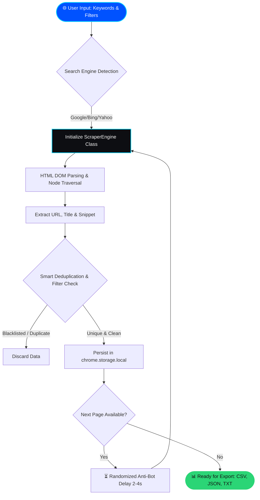

  
# 🚀 Search Link Extractor Pro 🔍
  
**Ultimate Enterprise-Grade Web Scraping & Data Extraction Chrome Extension**
  
  
  
  
  

  

     
    <i>The most advanced and professional automation tool to extract thousands of search result links, titles, and meta descriptions automatically from Google, Bing, Yahoo, and DuckDuckGo. Purpose-built for SEO, Lead Generation, and Data Mining professionals.</i>
  

---

## 🌟 Project Overview

**Search Link Extractor Pro** is a robust, Object-Oriented Chrome Extension designed to eliminate the hassle of manual search result collection. It features intelligent auto-pagination, multi-search engine support, and an advanced anti-bot pacing mechanism to prevent CAPTCHA triggers, ensuring a seamless data scraping experience.

---

## 📸 User Interface & Screenshots

  
  
    
  
  <table width="100%">
    <tr>
      <td width="50%" align="center">
        <b>Modern Glassmorphism Dashboard</b>  
        
      </td>
      <td width="50%" align="center">
        <b>Data Export & History Logs</b>  
        
      </td>
    </tr>
  </table>

---

## ⚙️ How It Works (System Architecture)

Below is an animated Mermaid.js flowchart demonstrating the underlying Object-Oriented scraping workflow:

---

## 🔥 Core Features

Engineered for enterprise-level performance, this extension packs the following capabilities:

1. 🌍 **Multi-Engine Support:** Dynamically adapts CSS selectors to scrape from **Google, Bing, Yahoo, and DuckDuckGo**.
2. 🤖 **Auto-Pagination Engine:** Automatically detects and clicks the "Next" button, traversing through hundreds of SERPs without manual intervention.
3. 🛡️ **Anti-Bot Protection:** Implements asynchronous, randomized human-like delays (2 to 4 seconds) between page transitions to bypass IP bans and CAPTCHAs.
4. 🧠 **Smart Filtering & Deduplication:** Ensures absolute unique URLs utilizing a JavaScript `Set`. Includes an input field to blacklist specific domains (e.g., `wikipedia.org`).
5. 📂 **Multi-Format Export:** Download your enriched dataset with a single click in **CSV, JSON, or TXT** formats.
6. 🎨 **Premium UI/UX:** Built with a stunning dark Glassmorphism theme, CSS keyframe animations, live progress monitoring, and interactive tooltips.

---

## 📥 Output Formats Supported

Once the extraction is complete, data can be exported in three highly structured formats:

* 📊 **CSV (.csv):** Perfect for importing into Microsoft Excel, Google Sheets, or CRM systems for Lead Generation.
* 📜 **JSON (.json):** Ideal for developers to pipe data directly into external APIs, databases, or Node.js/Python backends.
* 📝 **TXT (.txt):** A clean, serialized plain-text format for quick human readability.

---

## 🛠️ Tech Stack & Architecture

Developed strictly following **Object-Oriented Programming (OOP)** principles:

* **Core Languages:** JavaScript (ES6+ Classes), HTML5, CSS3.
* **Framework Architecture:** Google Chrome Extension **Manifest V3** compliant.
* **State Management:** `chrome.storage.local` for robust offline database handling.
* **Design System:** Custom CSS Glassmorphism, SVG icons, and dynamic DOM manipulation.

---

## 🚀 Installation Guide

You can easily install this tool locally by downloading it directly from this repository:

1. **Download:** Navigate to the **[Releases](https://github.com/mmizan85/Search-Link-Extractor-Pro/releases)** section on the right side of this repository and download the latest `Search-Link-Extractor-Pro.zip` file.
2. **Extract:** Unzip the downloaded file to a folder on your computer.
3. **Load to Browser:**

* Open Google Chrome and go to `chrome://extensions/`.
* Enable **"Developer mode"** via the toggle switch in the top right corner.
* Click the **"Load unpacked"** button and select the extracted folder.

1. **Done:** Pin the extension to your toolbar and start extracting! 🎉

---

## 👨‍💻 Developer

Developed by **Mohammed Mizanur Rahman** — *Senior Software Engineer & Web Automation Expert*.

This tool was engineered to solve the complex challenges of web scraping, filtering, and data serialization in a fast, efficient, and beautifully designed package.

---

## 📄 License

This project is licensed under the **MIT License**.

You are free to use, modify, and distribute this software for personal or commercial projects. See the [LICENSE](LICENSE) file for more details.

